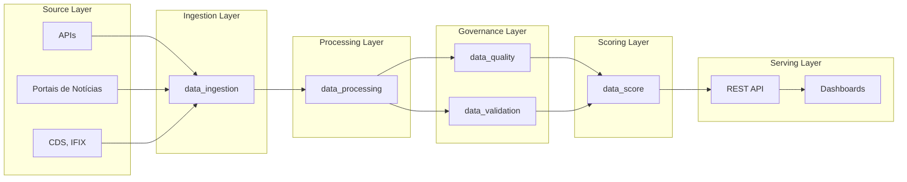
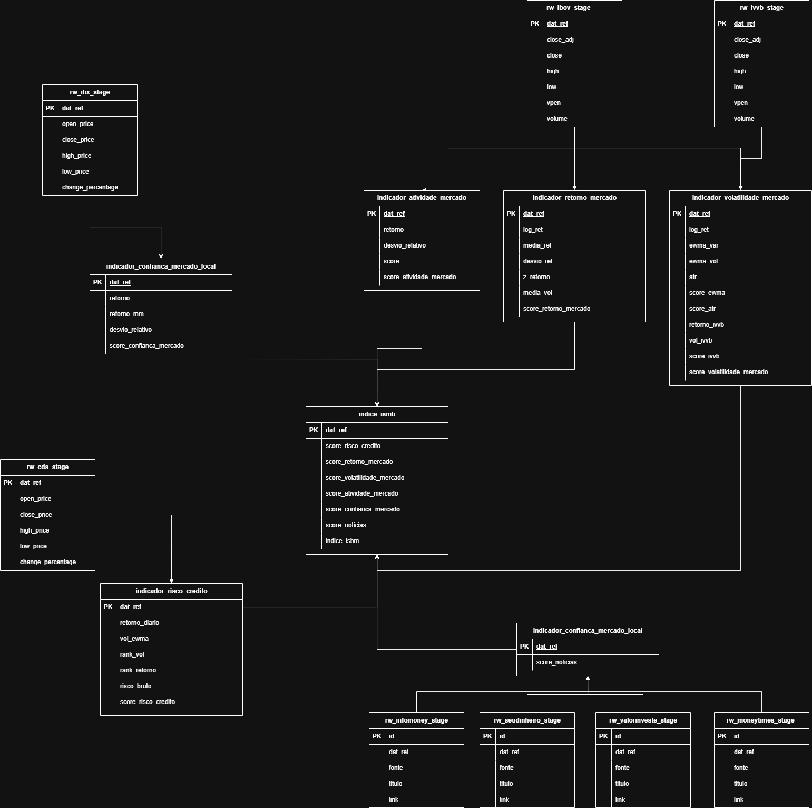

# ISMB - Índice de Sentimento do Mercado Brasileiro

Data platform de pipelines para ingestão, transformação e geração de métricas analíticas, do mercado financeiro.


## Sumário

- [Sumário](#sumário)
- [Sobre o Repositório](#sobre-o-repositório)
- [Instalação](#instalação)
    - [Requisitos](#requisitos)
- [Como executar](#como-executar)
- [Exemplo de usos]()
- [URLs relevantes]()
- [Status do Projeto]()
- [Contato]()

## Sobre o Repositório
ISMB (Índice de Sentimento do Mercado Brasileiro) é uma plataforma de engenharia de dados e análise dedicada a transformar fontes brutas em indicadores e scores analíticos diários para uso em pesquisa, monitoramento e tomada de decisão financeira. Este repositório contém pipelines, configurações e artefatos para ingestão, processamento, validação, versionamento e entrega de sinais quantitativos focados em sentimento, volatilidade, retorno e risco aplicados ao mercado financeiro brasileiro.

#### Visão geral da arquitetura

- Orquestração: Apache Airflow organiza as DAGs e dependências; em [`factory/conf/airflow/dags`](factory/conf/airflow/dags).
- Orquestração de pipelines: Kedro estrutura pipelines em [`/pipelines/`](factory/src/factory/pipelines) com nodes em cada domínio:
    - **data_ingestion**: Pipeline responsável pela coleta, normalização inicial e persistência de dados brutos.
    - **data_processing**: Pipeline responsável por aplicar as regras de cálculo dos indicadores analíticos a partir de dados brutos, produzindo datasets prontos para composição do score final.
    - **data_quality**: Pipeline responsável por avaliar a qualidade dos dados, aplicando verificações técnicas e estatísticas para garantir qualidade antes do uso analítico.
    - **data_validation**: Pipeline responsável por validar regras de negócio, garantindo que os dados estejam coerentes antes de serem consumidos.
    - **data_score**: Pipeline responsável pelo cálculo final de indicadores e score analítico.
- Configuração: parâmetros por ambiente em [conf/](factory/conf) (conf/base, conf/local, conf/airflow).
- Infraestrutura: API de serving dos dados analíticos e a aplicação web para consumo via dashboards.
- Armazenamento: datasets gerenciados pelo Kedro (CSV).

#### Arquitetura de Dados



#### Estrutura de pastas
```
.
├── factory
│   ├── conf
│   │   ├── airflow
│   │   │   ├── config
│   │   │   └── dags
│   │   ├── base
│   │   └── local
│   ├── data
│   │   ├── indicadores
│   │   ├── indice
│   │   ├── raw
│   │   │   ├── mercado
│   │   │   └── noticias
│   │   └── sandbox
│   │       └── dev
│   │           ├── indicadores
│   │           ├── indice
│   │           └── raw
│   │               ├── mercado
│   │               └── noticias
│   ├── docs
│   │   ├── imagens
│   │   ├── indicators
│   │   └── source
│   ├── src
│   │   └── factory
│   │       └── pipelines
│   │           ├── data_ingestion
│   │           ├── data_processing
│   │           └── data_score
│   └── tests
│       └── pipelines
│           ├── data_ingestion
│           ├── data_processing
│           └── data_score
└── infra
    └── aws
```

## Instalação

#### Requisitos
- Linux ou WSL (Windows Subsystem for Linux)
- Python 3.12

#### Instalação
1) Clone o repositório

```bash
> git clone https://github.com/diogojacomini/ismb-app.git; cd ismb-app
```

2) Crie e ative o ambiente virtual

Linux/WSL:
```bash
> python -m venv .venv; source .venv/bin/activate
```

3) Instale as dependências

```bash
> pip install -r factory/requirements.txt
```

## Como executar

Observação: para rodar local, ajuste os diretórios em `factory/conf/airflow/catalog.yml` (paths de dados conforme sua máquina). Também é necessário passar o ambiente correto.

1) Execute os pipelines Kedro (o único parâmetro obrigatório é `odate`; opcionais: `environment`, `process_full_data`)

```bash
> cd factory/
> kedro run --pipeline data_ingestion --params="odate=2025-08-14"
> kedro run --pipeline data_processing --params="odate=2025-08-14"
> kedro run --pipeline data_score --params="odate=2025-08-14"

# exemplo com parametro opcional:
> kedro run --pipeline data_processing --params="odate=2025-08-14, process_full_data=True"

# Descrição dos parametros:
# odate: Data de referencia;
# environment: ambiente (dev, hk, prd);
# process_full_data: Coleta e processamento de todo os dias disponiveis;
```